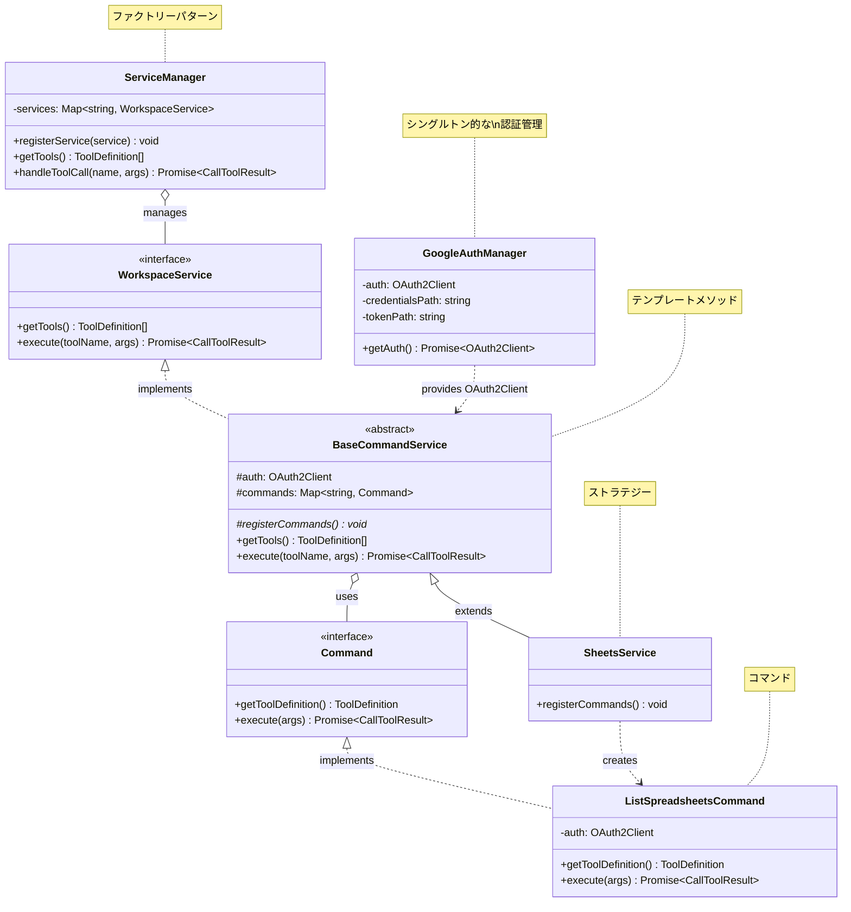

# クラス設計（クラス図）

このプロジェクトは複数のデザインパターンを組み合わせて、拡張性と保守性の高いアーキテクチャを実現しています。

## 採用しているデザインパターン

- **ストラテジーパターン**: 各 Google Workspace サービス（Sheets, Slides, Drive）を独立した戦略として実装
- **コマンドパターン**: 各ツールの操作を独立したコマンドクラスとしてカプセル化
- **ファクトリーパターン**: `ServiceManager` がサービスを統合管理し、適切なサービスに処理を振り分け
- **テンプレートメソッドパターン**: `BaseCommandService` が共通処理を提供し、サブクラスで具体的なコマンド登録を実装

> **Note**: 図は代表的なクラスのみを表示しています。実際には Slides/Drive サービスや各種コマンドクラスも同様のパターンで実装されています。
