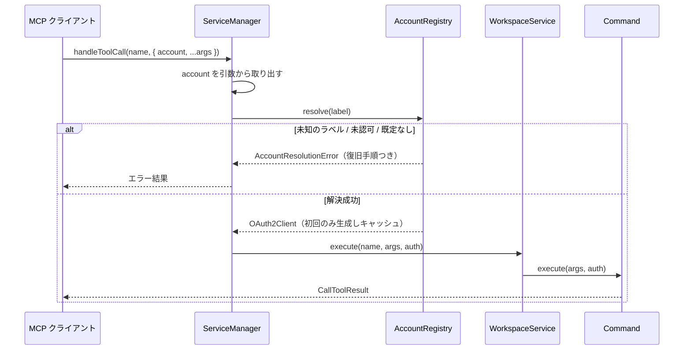
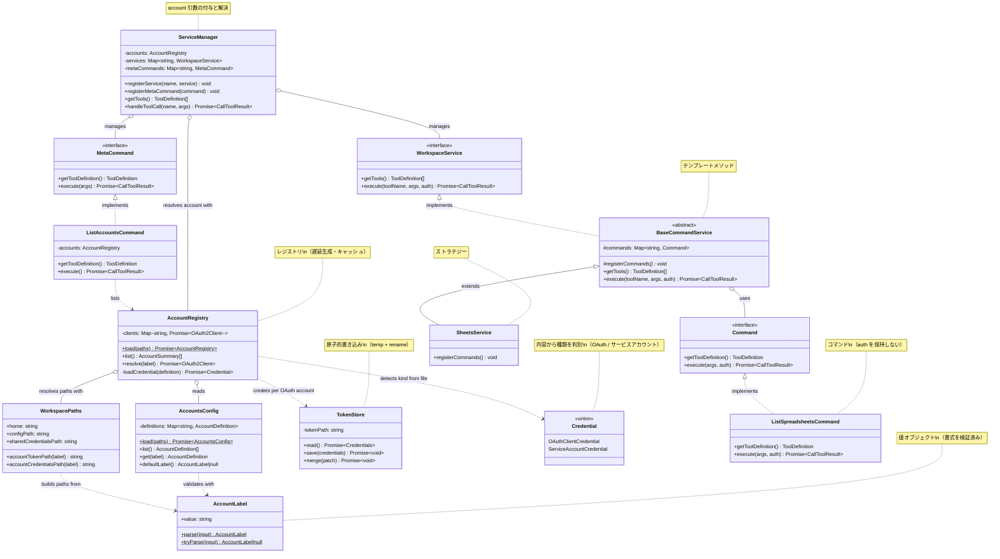

# クラス設計（クラス図）

このプロジェクトは複数のデザインパターンを組み合わせて、拡張性と保守性の高いアーキテクチャを実現しています。

## 採用しているデザインパターン

- **ストラテジーパターン**: 各 Google Workspace サービス（Sheets, Slides, Docs, Drive）を独立した戦略として実装
- **コマンドパターン**: 各ツールの操作を独立したコマンドクラスとしてカプセル化
- **レジストリパターン**: `AccountRegistry` がラベルから認証済みクライアントを解決し、生成済みのものをキャッシュ
- **値オブジェクト**: `AccountLabel` が書式を検証済みのラベルだけを存在させ、パストラバーサルを構造的に防ぐ
- **テンプレートメソッドパターン**: `BaseCommandService` が共通処理を提供し、サブクラスで具体的なコマンド登録を実装

## 認証クライアントの流れ

複数アカウント対応にあたり、**認証クライアントはコマンドが保持せず、実行時に渡す**構造にしています。
「どのアカウントで実行するか」を解釈する責務は `ServiceManager` と `AccountRegistry` に集約され、
各コマンドは渡されたクライアントで API を叩くだけの単一責任に保たれます。

```mermaid
sequenceDiagram
    participant Client as MCP クライアント
    participant SM as ServiceManager
    participant AR as AccountRegistry
    participant Svc as WorkspaceService
    participant Cmd as Command

    Client->>SM: handleToolCall(name, { account, ...args })
    SM->>SM: account を引数から取り出す
    SM->>AR: resolve(label)
    alt 未知のラベル / 未認可 / 既定なし
        AR-->>SM: AccountResolutionError（復旧手順つき）
        SM-->>Client: エラー結果
    else 解決成功
        AR-->>SM: OAuth2Client（初回のみ生成しキャッシュ）
        SM->>Svc: execute(name, args, auth)
        Svc->>Cmd: execute(args, auth)
        Cmd-->>Client: CallToolResult
    end
```

## クラス図

```mermaid
classDiagram
    %% アカウント管理
    class AccountLabel {
        +value: string
        +parse(input)$ AccountLabel
        +tryParse(input)$ AccountLabel|null
    }

    class WorkspacePaths {
        +home: string
        +configPath: string
        +sharedCredentialsPath: string
        +accountTokenPath(label) string
        +accountCredentialsPath(label) string
    }

    class AccountsConfig {
        -definitions: Map~string, AccountDefinition~
        +load(paths)$ Promise~AccountsConfig~
        +list() AccountDefinition[]
        +get(label) AccountDefinition
        +defaultLabel() AccountLabel|null
    }

    class TokenStore {
        -tokenPath: string
        +read() Promise~Credentials~
        +save(credentials) Promise~void~
        +merge(patch) Promise~void~
    }

    class AccountRegistry {
        -clients: Map~string, Promise~OAuth2Client~~
        +load(paths)$ Promise~AccountRegistry~
        +list() AccountSummary[]
        +resolve(label) Promise~OAuth2Client~
        -loadCredential(definition) Promise~Credential~
    }

    class Credential {
        <<union>>
        OAuthClientCredential
        ServiceAccountCredential
    }

    %% コアインターフェース
    class Command {
        <<interface>>
        +getToolDefinition() ToolDefinition
        +execute(args, auth) Promise~CallToolResult~
    }

    class MetaCommand {
        <<interface>>
        +getToolDefinition() ToolDefinition
        +execute(args) Promise~CallToolResult~
    }

    class WorkspaceService {
        <<interface>>
        +getTools() ToolDefinition[]
        +execute(toolName, args, auth) Promise~CallToolResult~
    }

    %% 基底クラスとマネージャー
    class BaseCommandService {
        <<abstract>>
        #commands: Map~string, Command~
        #registerCommands()* void
        +getTools() ToolDefinition[]
        +execute(toolName, args, auth) Promise~CallToolResult~
    }

    class ServiceManager {
        -accounts: AccountRegistry
        -services: Map~string, WorkspaceService~
        -metaCommands: Map~string, MetaCommand~
        +registerService(name, service) void
        +registerMetaCommand(command) void
        +getTools() ToolDefinition[]
        +handleToolCall(name, args) Promise~CallToolResult~
    }

    %% 具体例（代表）
    class SheetsService {
        +registerCommands() void
    }

    class ListSpreadsheetsCommand {
        +getToolDefinition() ToolDefinition
        +execute(args, auth) Promise~CallToolResult~
    }

    class ListAccountsCommand {
        -accounts: AccountRegistry
        +getToolDefinition() ToolDefinition
        +execute() Promise~CallToolResult~
    }

    %% 関係性
    AccountRegistry o-- AccountsConfig : reads
    AccountRegistry o-- WorkspacePaths : resolves paths with
    AccountRegistry ..> TokenStore : creates per OAuth account
    AccountRegistry ..> Credential : detects kind from file
    AccountsConfig ..> AccountLabel : validates with
    WorkspacePaths ..> AccountLabel : builds paths from

    ServiceManager o-- AccountRegistry : resolves account with
    ServiceManager o-- WorkspaceService : manages
    ServiceManager o-- MetaCommand : manages
    WorkspaceService <|.. BaseCommandService : implements
    BaseCommandService <|-- SheetsService : extends
    BaseCommandService o-- Command : uses
    Command <|.. ListSpreadsheetsCommand : implements
    MetaCommand <|.. ListAccountsCommand : implements
    ListAccountsCommand ..> AccountRegistry : lists

    note for AccountLabel "値オブジェクト\n（書式を検証済み）"
    note for AccountRegistry "レジストリ\n（遅延生成・キャッシュ）"
    note for TokenStore "原子的書き込み\n（temp + rename）"
    note for Credential "内容から種類を判別\n（OAuth / サービスアカウント）"
    note for ServiceManager "account 引数の付与と解決"
    note for BaseCommandService "テンプレートメソッド"
    note for SheetsService "ストラテジー"
    note for ListSpreadsheetsCommand "コマンド\n（auth を保持しない）"
```

> **Note**: 図は代表的なクラスのみを表示しています。実際には Slides/Docs/Drive サービスや各種コマンドクラスも同様のパターンで実装されています。

## 設計上の判断

| 判断                                                 | 理由                                                                                                                              |
| ---------------------------------------------------- | --------------------------------------------------------------------------------------------------------------------------------- |
| `account` をコマンドではなく `ServiceManager` が扱う | コマンドを増やしたときの `account` の書き忘れを構造的に防ぐため                                                                   |
| サーバーを分けず 1 プロセスで複数アカウントを持つ    | ツール定義がアカウント数に比例して増えず、アカウントを跨ぐ操作も 1 セッションで完結するため                                       |
| クライアントを起動時ではなく初回使用時に生成する     | 1 アカウントのトークン失効で全アカウントが使えなくなるのを防ぐため                                                                |
| ラベルを主キーにし、メールアドレスを保持しない       | 引数・ファイル名・ログ・エラー文面に個人情報が載らないようにするため                                                              |
| スコープをアカウントごとに変えられるようにしない     | 実際に困っていない段階で設定と分岐を複雑化させないため（必要になれば `accounts.json` に任意項目を足せば後方互換のまま拡張できる） |
