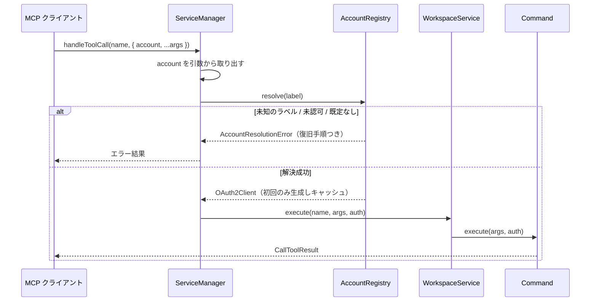

# クラス設計（クラス図）

このプロジェクトは複数のデザインパターンを組み合わせて、拡張性と保守性の高いアーキテクチャを実現しています。

## 採用しているデザインパターン

- **ストラテジーパターン**: 各 Google Workspace サービス（Sheets, Slides, Docs, Drive）を独立した戦略として実装
- **コマンドパターン**: 各ツールの操作を独立したコマンドクラスとしてカプセル化
- **レジストリパターン**: `AccountRegistry` がラベルから認証済みクライアントを解決し、生成済みのものをキャッシュ
- **値オブジェクト**: `AccountLabel` が書式を検証済みのラベルだけを存在させ、パストラバーサルを構造的に防ぐ
- **テンプレートメソッドパターン**: `BaseCommandService` が共通処理を提供し、サブクラスで具体的なコマンド登録を実装

## 認証クライアントの流れ

複数アカウント対応にあたり、**認証クライアントはコマンドが保持せず、実行時に渡す**構造にしています。
「どのアカウントで実行するか」を解釈する責務は `ServiceManager` と `AccountRegistry` に集約され、
各コマンドは渡されたクライアントで API を叩くだけの単一責任に保たれます。

```mermaid
sequenceDiagram
    participant Client as MCP クライアント
    participant SM as ServiceManager
    participant AR as AccountRegistry
    participant Svc as WorkspaceService
    participant Cmd as Command

    Client->>SM: handleToolCall(name, { account, ...args })
    SM->>SM: account を引数から取り出す
    SM->>AR: resolve(label)
    alt 未知のラベル / 未認可 / 既定なし
        AR-->>SM: AccountResolutionError（復旧手順つき）
        SM-->>Client: エラー結果
    else 解決成功
        AR-->>SM: OAuth2Client（初回のみ生成しキャッシュ）
        SM->>Svc: execute(name, args, auth)
        Svc->>Cmd: execute(args, auth)
        Cmd-->>Client: CallToolResult
    end
```

## クラス図

```mermaid
classDiagram
    %% アカウント管理
    class AccountLabel {
        +value: string
        +parse(input)$ AccountLabel
        +tryParse(input)$ AccountLabel|null
    }

    class WorkspacePaths {
        +home: string
        +configPath: string
        +sharedCredentialsPath: string
        +accountTokenPath(label) string
        +accountCredentialsPath(label) string
    }

    class AccountsConfig {
        -definitions: Map~string, AccountDefinition~
        +load(paths)$ Promise~AccountsConfig~
        +list() AccountDefinition[]
        +get(label) AccountDefinition
        +defaultLabel() AccountLabel|null
    }

    class TokenStore {
        -tokenPath: string
        +read() Promise~Credentials~
        +save(credentials) Promise~void~
        +merge(patch) Promise~void~
    }

    class AccountRegistry {
        -clients: Map~string, Promise~OAuth2Client~~
        +load(paths)$ Promise~AccountRegistry~
        +list() AccountSummary[]
        +resolve(label) Promise~OAuth2Client~
        -loadCredential(definition) Promise~Credential~
    }

    class Credential {
        <<union>>
        OAuthClientCredential
        ServiceAccountCredential
    }

    %% コアインターフェース
    class Command {
        <<interface>>
        +getToolDefinition() ToolDefinition
        +execute(args, auth) Promise~CallToolResult~
    }

    class MetaCommand {
        <<interface>>
        +getToolDefinition() ToolDefinition
        +execute(args) Promise~CallToolResult~
    }

    class WorkspaceService {
        <<interface>>
        +getTools() ToolDefinition[]
        +execute(toolName, args, auth) Promise~CallToolResult~
    }

    %% 基底クラスとマネージャー
    class BaseCommandService {
        <<abstract>>
        #commands: Map~string, Command~
        #registerCommands()* void
        +getTools() ToolDefinition[]
        +execute(toolName, args, auth) Promise~CallToolResult~
    }

    class ServiceManager {
        -accounts: AccountRegistry
        -services: Map~string, WorkspaceService~
        -metaCommands: Map~string, MetaCommand~
        +registerService(name, service) void
        +registerMetaCommand(command) void
        +getTools() ToolDefinition[]
        +handleToolCall(name, args) Promise~CallToolResult~
    }

    %% 具体例（代表）
    class SheetsService {
        +registerCommands() void
    }

    class ListSpreadsheetsCommand {
        +getToolDefinition() ToolDefinition
        +execute(args, auth) Promise~CallToolResult~
    }

    class ListAccountsCommand {
        -accounts: AccountRegistry
        +getToolDefinition() ToolDefinition
        +execute() Promise~CallToolResult~
    }

    class FormatCellsCommand {
        +getToolDefinition() ToolDefinition
        +execute(args, auth) Promise~CallToolResult~
    }

    class SlidesService {
        +registerCommands() void
    }

    class AddSlideCommand {
        +getToolDefinition() ToolDefinition
        +execute(args, auth) Promise~CallToolResult~
    }

    class UpdateElementTransformCommand {
        +getToolDefinition() ToolDefinition
        +execute(args, auth) Promise~CallToolResult~
    }

    class AddLineCommand {
        +getToolDefinition() ToolDefinition
        +execute(args, auth) Promise~CallToolResult~
    }

    class SetDataValidationCommand {
        +getToolDefinition() ToolDefinition
        +execute(args, auth) Promise~CallToolResult~
    }

    class SortRangeCommand {
        +getToolDefinition() ToolDefinition
        +execute(args, auth) Promise~CallToolResult~
    }

    %% 書式のヘルパー（純粋な変換と API 呼び出しを分ける）
    class GridRange {
        <<module>>
        +toGridIndexes(range) GridIndexes
        +toA1Range(indexes, sheetTitle) string
        +toColumnIndex(value, name) number
    }

    class Condition {
        <<module>>
        +toBooleanCondition(value, allowed, name) BooleanCondition
        +CONDITIONAL_FORMAT_CONDITION_TYPES
        +DATA_VALIDATION_CONDITION_TYPES
        +FILTER_CONDITION_TYPES
    }

    class SortSpec {
        <<module>>
        +toSortSpecs(value, name) SortSpec[]
        +describeSortSpecs(specs) string
    }

    class CellFormat {
        <<module>>
        +toCellFormat(args) CellFormatResult
    }

    class Color {
        <<module>>
        +hexToRgb(hex) RgbColor
    }

    class SheetIds {
        <<interface>>
        +of(range) number
        +byTitle(title) number
        +titles: string[]
    }

    %% Slides のヘルパー（寸法・範囲・行列の変換を純粋関数に切り出す）
    class Dimensions {
        <<module>>
        +pointsToEmu(points) number
        +emuToPoints(emu) number
        +toElementProperties(pageObjectId, box) PageElementProperties
        +centeredOn(width, height) Position
    }

    class NumberArgument {
        <<module>>
        +toNumber(value, name) number
        +toOptionalNumber(value, name) number
    }

    class ElementTransform {
        <<module>>
        +toAbsoluteTransform(geometry, target) AffineTransform
        +toPlacement(geometry) Placement
    }

    class LineGeometry {
        <<module>>
        +toLineElementProperties(pageObjectId, ends) PageElementProperties
    }

    class LineStyle {
        <<module>>
        +toLineProperties(args) LinePropertiesResult
        +LINE_CATEGORIES
        +DASH_STYLES
        +ARROW_STYLES
    }

    class ParagraphStyle {
        <<module>>
        +toParagraphStyle(args) ParagraphStyleResult
        +ALIGNMENTS
    }

    class LayoutPlaceholders {
        <<module>>
        +pickPlaceholder(placeholders, role) PlaceholderRef
        +describePlaceholders(placeholders) string
        +PREDEFINED_LAYOUTS
    }

    class TableGrid {
        <<module>>
        +toTableGrid(value, name) TableGrid
        +toCellTextRequests(objectId, grid) Request[]
    }

    class TextRange {
        <<module>>
        +toTextRange(startIndex, endIndex) Range
    }

    class TextStyle {
        <<module>>
        +toTextStyle(args) TextStyleResult
    }

    class PresentationLookup {
        <<module>>
        +fetchElementGeometry(slides, presentationId, objectId) ElementGeometry
        +fetchLayoutPlaceholders(slides, presentationId, layoutName) PlaceholderRef[]
    }

    %% 関係性
    AccountRegistry o-- AccountsConfig : reads
    AccountRegistry o-- WorkspacePaths : resolves paths with
    AccountRegistry ..> TokenStore : creates per OAuth account
    AccountRegistry ..> Credential : detects kind from file
    AccountsConfig ..> AccountLabel : validates with
    WorkspacePaths ..> AccountLabel : builds paths from

    ServiceManager o-- AccountRegistry : resolves account with
    ServiceManager o-- WorkspaceService : manages
    ServiceManager o-- MetaCommand : manages
    WorkspaceService <|.. BaseCommandService : implements
    BaseCommandService <|-- SheetsService : extends
    BaseCommandService o-- Command : uses
    Command <|.. ListSpreadsheetsCommand : implements
    MetaCommand <|.. ListAccountsCommand : implements
    ListAccountsCommand ..> AccountRegistry : lists

    Command <|.. FormatCellsCommand : implements
    FormatCellsCommand ..> GridRange : converts range with
    FormatCellsCommand ..> CellFormat : builds format with
    FormatCellsCommand ..> SheetIds : resolves sheetId with
    CellFormat ..> Color : converts color with

    Command <|.. SetDataValidationCommand : implements
    Command <|.. SortRangeCommand : implements
    SetDataValidationCommand ..> Condition : builds condition with
    SetDataValidationCommand ..> SheetIds : resolves sheetId with
    SortRangeCommand ..> SortSpec : builds sort keys with
    SortSpec ..> GridRange : converts column letters with

    BaseCommandService <|-- SlidesService : extends
    Command <|.. AddSlideCommand : implements
    Command <|.. UpdateElementTransformCommand : implements
    Command <|.. AddLineCommand : implements
    AddSlideCommand ..> LayoutPlaceholders : picks placeholder with
    AddSlideCommand ..> PresentationLookup : reads layouts with
    UpdateElementTransformCommand ..> ElementTransform : builds matrix with
    UpdateElementTransformCommand ..> PresentationLookup : reads current size with
    AddLineCommand ..> LineGeometry : converts two points with
    AddLineCommand ..> LineStyle : builds look with
    ElementTransform ..> Dimensions : converts points with
    TextStyle ..> Color : converts color with
    LineStyle ..> Color : converts color with
    ParagraphStyle ..> NumberArgument : reads lengths with
    LineStyle ..> NumberArgument : reads thickness with

    note for AccountLabel "値オブジェクト\n（書式を検証済み）"
    note for AccountRegistry "レジストリ\n（遅延生成・キャッシュ）"
    note for TokenStore "原子的書き込み\n（temp + rename）"
    note for Credential "内容から種類を判別\n（OAuth / サービスアカウント）"
    note for ServiceManager "account 引数の付与と解決"
    note for BaseCommandService "テンプレートメソッド"
    note for SheetsService "ストラテジー"
    note for ListSpreadsheetsCommand "コマンド\n（auth を保持しない）"
    note for FormatCellsCommand "書式コマンド\n（ヘルパーに委ねる）"
    note for GridRange "純粋な変換\n（API を知らない）"
    note for Condition "用途ごとに使える\nConditionType が違う"
    note for SortSpec "並べ替えとフィルタで共用"
    note for Color "Sheets と Slides で共用"
    note for SheetIds "シート一覧を 1 度だけ引く"
    note for SlidesService "ストラテジー"
    note for Dimensions "新ツールはポイント\n（ADR 0004）"
    note for ElementTransform "size は変えられないので倍率を逆算する。\n鏡映を潰さないよう符号は行列式から戻す"
    note for LineGeometry "向きは scale の符号で表す"
    note for PresentationLookup "Slides で API を読むのはここだけ"
```

> **Note**: 図は代表的なクラスのみを表示しています。実際には Slides/Docs/Drive サービスや各種コマンドクラスも同様のパターンで実装されています。

## 設計上の判断

| 判断                                                                                            | 理由                                                                                                                                                                                    |
| ----------------------------------------------------------------------------------------------- | --------------------------------------------------------------------------------------------------------------------------------------------------------------------------------------- |
| `account` をコマンドではなく `ServiceManager` が扱う                                            | コマンドを増やしたときの `account` の書き忘れを構造的に防ぐため                                                                                                                         |
| サーバーを分けず 1 プロセスで複数アカウントを持つ                                               | ツール定義がアカウント数に比例して増えず、アカウントを跨ぐ操作も 1 セッションで完結するため                                                                                             |
| クライアントを起動時ではなく初回使用時に生成する                                                | 1 アカウントのトークン失効で全アカウントが使えなくなるのを防ぐため                                                                                                                      |
| ラベルを主キーにし、メールアドレスを保持しない                                                  | 引数・ファイル名・ログ・エラー文面に個人情報が載らないようにするため                                                                                                                    |
| スコープをアカウントごとに変えられるようにしない                                                | 実際に困っていない段階で設定と分岐を複雑化させないため（必要になれば `accounts.json` に任意項目を足せば後方互換のまま拡張できる）                                                       |
| 書式ツールの範囲を A1 記法に統一し、sheetId を毎回引く                                          | 利用者と AI が読み書きするのは A1 記法であり、行列番号を外に出さないため（[ADR 0001](./adr/0001-a1-notation-for-formatting-range.md)）                                                  |
| 色を 16 進数で受け、変換を 1 モジュールに集約する                                               | Sheets と Slides で同じ変換が重複していたため。`src/tools/shared/color.ts` に集約した                                                                                                   |
| 条件（`BooleanCondition`）の組み立てを共通化し、使える `ConditionType` の集合は呼び出し側が渡す | 条件付き書式・入力規則・フィルタで同じ形を使うが、受け付ける型はそれぞれ別の部分集合で、用途違いは API に弾かれるため                                                                   |
| 入力規則の設定と解除を別ツールにする                                                            | Sheets API は `rule` を省略すると解除になるが、引数の省略が破壊的操作に化けるのを避けるため                                                                                             |
| Slides の新しいツールの寸法をポイントで受け、既存の EMU ツールは据え置く                        | 720 × 405 pt のスライドでは呼ぶ側がポイントをそのまま組み立てられる一方、既存ツールの単位を変えると黙って 72 分の 1 になるため（[ADR 0004](./adr/0004-points-for-new-slides-tools.md)） |
| 箇条書きの解除とグループの解除を、設定とは別のツールにする                                      | 入力規則と同じく、引数の省略が破壊的操作に化けるのを避けるため                                                                                                                          |
| Slides で API を読むのを `presentation-lookup.ts` 1 つに閉じる                                  | 寸法・行列・レイアウトの変換を純粋関数のまま保ち、テストを API 抜きで書けるようにするため                                                                                               |
